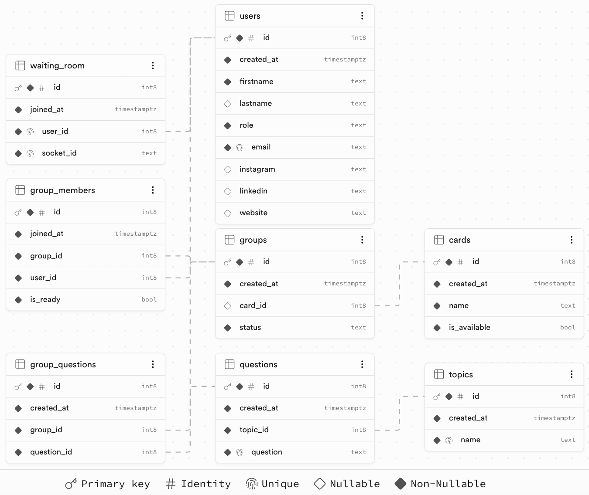

# Mingle Tool

A real-time networking app designed for events where students and companies will be grouped together to create conversations and connect with each other.

## What it does

Participants scan two different QR codes, one for students and one for companies. They fill in their contact details, and get placed in a waiting room. When three students and one company are ready, the app automatically matches them into a group, assigns them a shared animal card and three discussion questions, and finally lets them exchange contact information.

## Tech Stack

**Client**
- React 19 + Vite
- Tailwind CSS v4
- Zustand (global state + sessionStorage persistence)
- Socket.io-client
- React Router v7

**Server**
- Node.js + Express
- Socket.io
- Supabase (PostgreSQL)

## Architecture

```
Client (React)
  ↕ REST (registration)
  ↕ WebSocket / Socket.io (real-time matching)
Server (Express + Socket.io)
  ↕
Supabase (database)
```

The server exposes one REST endpoint (`POST /register`) and handles all real-time logic via Socket.io events.

## App Flow

```
Register → Rules → Waiting Room → Matching → Questions → Contacts
```

1. **Register** — user fills in name, email, and optional social links; role (student or company) is determined by the QR code scanned to enter the app
2. **Rules** — explains how the game works
3. **Waiting Room** — user joins the queue, server waits for 3 students + 1 company
4. **Matching** — group receives a shared animal card to use to find their group-members
5. **Questions** — group discusses 3 randomly assigned questions
6. **Contacts** — group members can view and copy each other's contact information. From here they can start a new round — the registration form will be pre-filled with their previous details so they can update if needed or continue straight away

## Project Structure

```
mingle-tool/
├── client/
│   └── src/
│       ├── assets/          # SVGs, icons, video
│       ├── components/      # Shared components (Button, Text, ProtectedRoute)
│       ├── features/        # One folder per page/feature
│       │   ├── register/
│       │   ├── rules/
│       │   ├── waiting/
│       │   ├── matching/
│       │   ├── questions/
│       │   └── contact/
│       ├── services/        # Socket.io client
│       └── store/           # Zustand store
└── server/
    ├── index.js             # Entry point
    └── src/
        ├── controllers/     # Business logic (card, user, group members, questions)
        ├── services/        # Match orchestration
        ├── db/
        │   ├── models/      # Supabase queries
        │   ├── seeds/       # Seed scripts
        │   └── supabase.js  # Supabase client
        ├── routes/          # Express routes
        └── socket/          # Socket.io setup and handlers
```

### Database Tables




## Deployment

- **Backend** — Railway
- **Frontend** — Vercel
